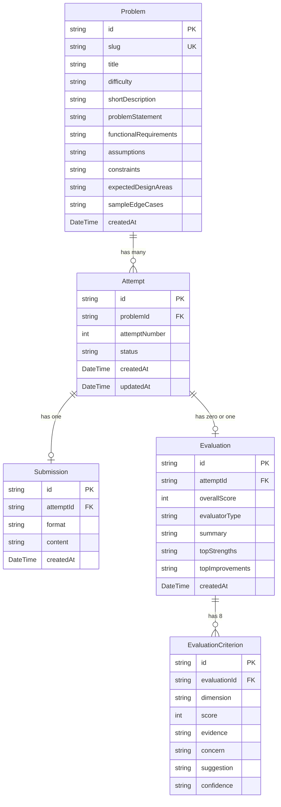

# LLD Practice Platform — System Architecture & Design Document

**Document Version:** 1.0.0  
**Target System:** Modular Monolith with Layered Domain Architecture  

---

## 1. System Overview & MVP Scope

The **LLD Practice Platform** is a specialized developer education system that enables software engineers to practice Low-Level Object-Oriented Design (LLD) and receive explainable, rubric-grounded architectural feedback.

### Key Invariants:
1. **Zero External Dependency at Runtime:** The core application executes locally using SQLite (`file:./prisma/dev.db`) and a deterministic, heuristic-driven Rule-Based Evaluator.
2. **Pluggable Evaluation Strategies:** If an OpenAI/LLM API key is present, the system seamlessly enables the AI Evaluator without altering client workflows or database records.
3. **Data Loss Prevention:** Submissions are persisted *prior* to evaluation execution. If an evaluation times out or encounters a schema violation, the attempt transitions to `FAILED`, the submission is preserved, and the learner can trigger a retry.
4. **Attempt Immutability:** Attempt #1 is never overwritten when a learner clicks "Try Again". A distinct Attempt #2 is created, enabling genuine score progression tracking.

---

## 2. Core Learner Flow

```
┌─────────────────┐       ┌────────────────────────┐       ┌────────────────────────┐
│ Browse Problems │ ────► │ Review Requirements &  │ ────► │ Practice Workspace     │
│   (/problems)   │       │ Constraints (/slug)    │       │ (/slug/practice)       │
└─────────────────┘       └────────────────────────┘       └───────────┬────────────┘
                                                                       │
                                                            Fill 9 Structured Fields
                                                            (or Load Starter Template)
                                                                       │
                                                                       ▼
┌─────────────────┐       ┌────────────────────────┐       ┌────────────────────────┐
│ Try Again Flow  │ ◄──── │ Feedback Review        │ ◄──── │ Submission & Evaluator │
│  (Attempt #N+1) │       │ (/attempts/[id])       │       │ Status Machine         │
└─────────────────┘       └────────────────────────┘       └────────────────────────┘
```

---

## 3. Layered Architectural Model

The platform avoids architectural bloat (no microservices, Kafka, or Kubernetes) in favor of a **Clean Modular Monolith**:

```
src/
├── app/                        # Presentation Layer (Next.js 15 App Router)
│   ├── api/                    # RESTful endpoints (/api/problems, /api/attempts)
│   ├── problems/               # Problem library and detail pages
│   ├── attempts/               # Attempt history and feedback review pages
│   ├── layout.tsx              # Root shell layout with theme tokens
│   └── page.tsx                # Learner metrics dashboard
├── components/                 # Presentation Components
│   ├── feedback/               # AttemptReview & Rubric criterion cards
│   ├── practice/               # PracticeWorkspace split-view editor
│   └── ui/                     # Badges, ScoreGauge, Modal
├── application/                # Application & Orchestration Services Layer
│   └── services/
│       ├── PracticeService.ts  # Attempt lifecycle, validation, draft saves, retries
│       ├── EvaluationService.ts# Evaluator strategy selection, status locks
│       └── ProblemService.ts   # Problem queries, metrics aggregation
├── domain/                     # Pure Domain Business Logic
│   ├── entities/ & types/      # Core entities, enums, payload contracts
│   ├── evaluators/             # Evaluator strategy interface
│   ├── rubric/                 # 8-dimension rubric definitions & weights
│   ├── schemas/                # Zod schemas for submission and evaluation
│   └── templates/              # Starter templates for each LLD problem
└── infrastructure/             # Persistence & External Adapters Layer
    ├── db/prisma.ts            # Prisma SQLite client singleton
    ├── repositories/           # ProblemRepository, AttemptRepository
    └── evaluators/
        ├── RuleBasedEvaluator.ts # Deterministic AST/heuristic analyzer
        └── AIEvaluator.ts      # LLM structured JSON output evaluator
```

---

## 4. Domain Entities & Database Schema

The persistence layer is modeled in SQLite via Prisma:



---

## 5. Submission Lifecycle State Machine

The attempt lifecycle transitions through explicit states to guarantee transactional integrity:

```
          ┌─────────────┐
          │    DRAFT    │ ◄─── Initial state on practice start
          └──────┬──────┘
                 │
           User clicks "Submit"
           Payload validated with Zod
           Submission saved to DB
                 │
                 ▼
          ┌─────────────┐
          │  SUBMITTED  │ ◄─── Submission persisted safely
          └──────┬──────┘
                 │
           EvaluationService locks attempt
                 │
                 ▼
          ┌─────────────┐
          │ EVALUATING  │ ◄─── In-progress evaluation lock
          └──────┬──────┘
                 │
         ┌───────┴────────┐
         │                │
    Success             Failure (e.g. LLM timeout)
         │                │
         ▼                ▼
  ┌─────────────┐  ┌─────────────┐
  │  COMPLETED  │  │   FAILED    │ ◄─── Submission NOT deleted;
  └─────────────┘  └─────────────┘      allows manual retry
```

- **Invariant:** If evaluation crashes or times out, the attempt is marked `FAILED`. The submission text in the database is untouched.
- **Concurrency Lock:** If an attempt is in `EVALUATING` or `COMPLETED`, duplicate submissions are rejected immediately.

---

## 6. Evaluation Architecture & Strategy Pattern

```
                       ┌─────────────────────────┐
                       │   EvaluationService     │
                       └────────────┬────────────┘
                                    │ consumes
                                    ▼
                       ┌─────────────────────────┐
                       │   «interface» Evaluator │
                       │ + evaluate(): Result    │
                       └────────────┬────────────┘
                                    │
           ┌────────────────────────┴────────────────────────┐
           ▼                                                 ▼
┌─────────────────────────┐                       ┌─────────────────────────┐
│   RuleBasedEvaluator    │                       │       AIEvaluator       │
│  (Deterministic AST &   │                       │   (Structured JSON LLM  │
│   Heuristic Parser)     │                       │    + Zod Validator)     │
└─────────────────────────┘                       └─────────────────────────┘
```

### Division of Responsibility: Deterministic vs AI

| Evaluation Aspect | Rule-Based Evaluator | AI Evaluator |
| :--- | :--- | :--- |
| **Submission Structure & Completeness** | Validates all 9 mandatory sections exist; checks minimum substantive word counts. | Validates whether arguments are cohesive. |
| **Class Responsibilities (SRP)** | Analyzes method verbs & class names; flags God-classes handling >3 domains (e.g., ParkingLot doing pricing + allocation + database). | Analyzes nuance of domain boundary delegation. |
| **Coupling & Cohesion** | Checks for composition ("has-a") vs inheritance ("is-a"); detects deeply nested class hierarchies. | Evaluates if dependency injection and loose coupling are respected. |
| **Design Patterns** | Identifies occurrences of GoF patterns (Strategy, State, Factory, Observer) and checks if applied to right problem areas. | Evaluates whether patterns were appropriately applied or over-engineered. |
| **Extensibility (OCP)** | Evaluates presence of extensible interfaces and polymorphism versus hardcoded `switch` statements. | Mentions realistic future business evolutions and checks if design accommodates them. |
| **Edge Cases & Concurrency** | Checks for thread synchronization, atomic reservation, capacity exhaustion, and lost tickets. | Analyzes race condition lock granularity (e.g., pessimistic vs optimistic locking). |
| **Quality of Feedback** | Quotes exact lines from submission; outputs deterministic concerns & suggestions. | Contextualizes suggestions using production architectural trade-offs. |

---

## 7. Extensibility Proofing (Change Tests)

### Change Test A: Supporting Class Diagram Submissions
- **Requirement:** Today the learner submits structured text. Later the platform should support class diagrams (e.g., Mermaid.js, PlantUML, or JSON AST) without rewriting the practice flow.
- **Architectural Solution:**
  - `Submission.format` is modeled as a polymorphic descriptor (`STRUCTURED_TEXT`, `CLASS_DIAGRAM`, `CODE`).
  - `Submission.content` is stored as a stringified payload discriminated by `format`.
  - The `Evaluator` interface accepts a union or polymorphic payload. A future `ClassDiagramEvaluator` can simply parse UML nodes and edges into class/relationship ASTs and feed them to the existing rubric evaluator without touching `PracticeService` or `AttemptRepository`.

### Change Test B: Supporting Pluggable Evaluators
- **Requirement:** Add `RuleBasedEvaluator`, `AIEvaluator`, `HumanEvaluator`, and `CompositeEvaluator` without rewriting the practice flow.
- **Architectural Solution:**
  - The `EvaluationService` adheres strictly to the Dependency Inversion Principle. It depends on `Evaluator`, not on concrete classes.
  - Adding a `HumanEvaluator` simply means implementing `Evaluator` with an asynchronous webhook or reviewer dashboard queue.
  - Adding a `CompositeEvaluator` involves combining scores from multiple evaluators (e.g., 40% Rule-Based heuristics + 60% AI reasoning) behind the identical `Evaluator` contract.

---

## 8. Scalability & Future Distributed Architecture

If this MVP expands from a single-machine educational tool to hundreds of thousands of concurrent learners, the following changes would be introduced:

1. **Background Async Evaluation Workers:**
   - Replace the in-process execution with an asynchronous queue (e.g., BullMQ with Redis or AWS SQS).
   - The submission enters `SUBMITTED` state, an event is emitted, and worker pods process evaluations independently.
   - The client UI uses WebSocket / Server-Sent Events (SSE) to update the status pill in real-time.
2. **Database Migration:**
   - Migrate from SQLite to PostgreSQL with read replicas.
   - Partition the `Attempt` and `Submission` tables by `problemId` or date range.
3. **LLM Evaluation Caching & Rate Limiting:**
   - Cache evaluation rubrics for identical/near-identical design hashes to avoid redundant token costs.
   - Introduce token-bucket rate limiting per learner.
